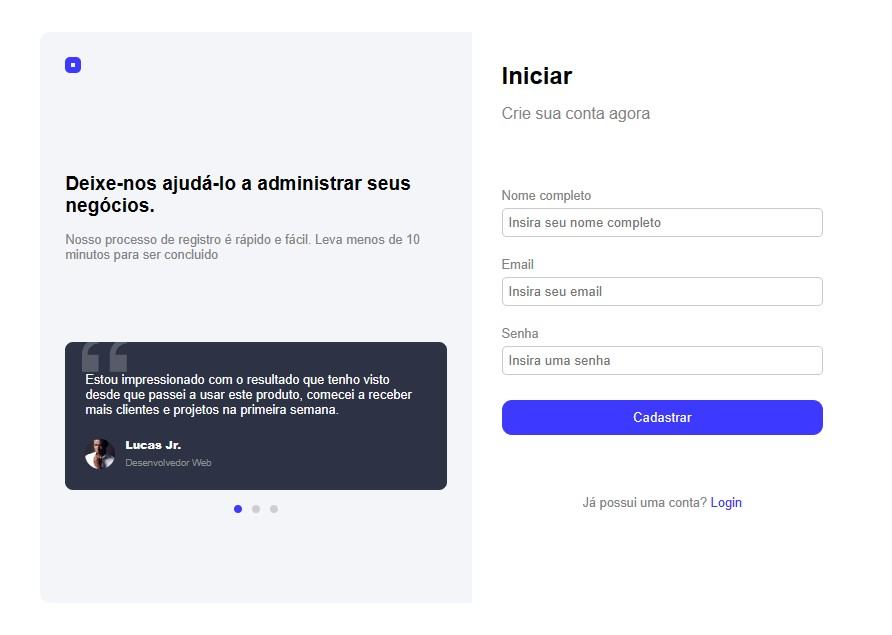

## 📑 Sobre

Neste projeto front-end de interface simples, baseado em HTML e CSS, simula  a tela de cadastro de usuários. Com os campos que permitirão que os usuários se registrem com seus dados pessoais, como nome, email e senha.
O layout foi inspirado a partir do designer de Vishnu Prasad que se encontra no site dribbble.com

🧾 [Creditos](https://dribbble.com/shots/20453169-Get-Started-Screen)

 

## 🚀 Tecnologias

◻  
HTML 5

◻ 
Css 3

 
    

## 💻 Layout
 

