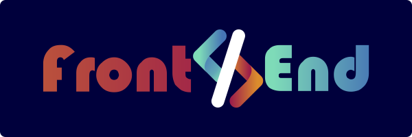

<h1 align="center">
    
</h1>

 

## 📑 Sobre

Este repositório contém os meus projetos frontend desenvolvidos com HTML, CSS e JavaScript. Aqui você pode encontrar exemplos de sites, jogos, aplicativos e outras ferramentas que eu criei para praticar e aprender novas habilidades. Todos os projetos estão disponíveis para visualização online e para download do código-fonte. Espero que você goste do meu trabalho e sinta-se à vontade para deixar seus comentários e sugestões.

 

## 🚀 Tecnologias

◻  
HTML 5

◻ 
Css 3

◻ 
JavaScript

 

##  ⚙ Projetos
* ✔ [Tela de cadastro designe de Vishnu Prasad]()